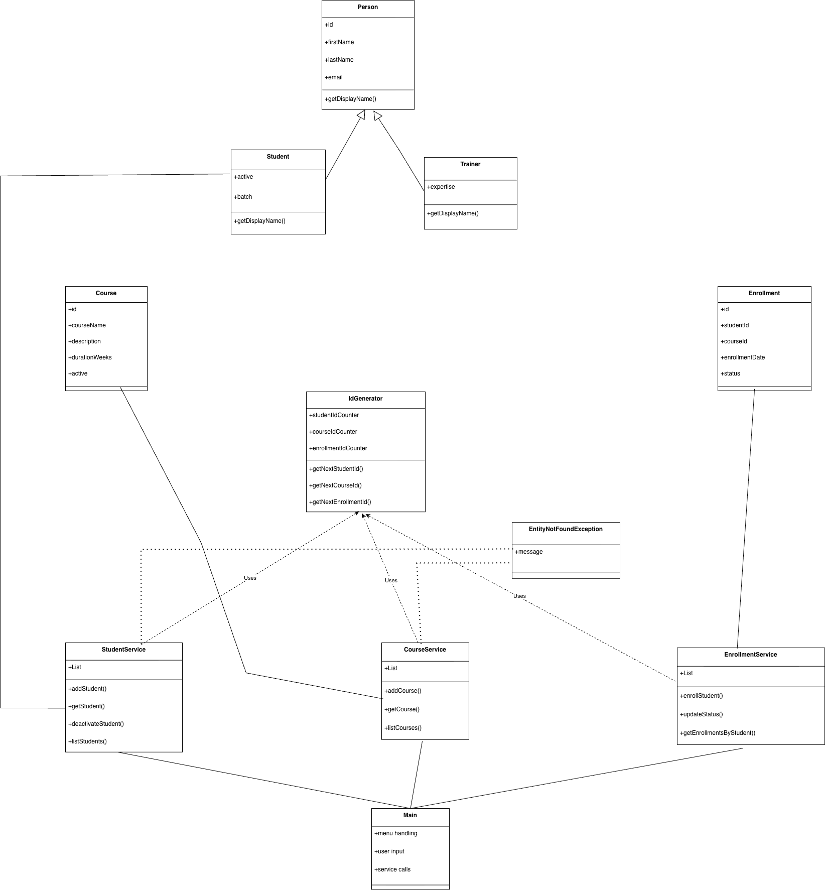

# Design Notes

This document explains some of the design choices made while building the LearnTrack application.

---

## Why ArrayList Instead of Arrays

I used `ArrayList` instead of plain arrays because the size of data is not fixed.

Students, courses, and enrollments are added dynamically while the application is running.  
Using arrays would require manual resizing logic, which would add unnecessary complexity at this stage.

`ArrayList` gives:
- Dynamic resizing
- Cleaner code
- Easier iteration and filtering

Since the goal was to focus on OOP and application flow, `ArrayList` was the most practical choice.

---

## Use of Static Members

Static members are used mainly in the `IdGenerator` utility class.

Examples:
- `getNextStudentId()`
- `getNextCourseId()`
- `getNextEnrollmentId()`

These counters are static because:
- IDs should be unique across the entire application
- They do not belong to a specific object instance
- They represent shared application-level state

Using static methods here avoids passing counters around between services and keeps ID generation centralized.

---

## Use of Inheritance

Inheritance is used through a simple hierarchy:

- `Person` (base class)
- `Student` and `Trainer` extending `Person`

This helped in:
- Avoiding duplication of common fields like `id`, `firstName`, `lastName`, and `email`
- Allowing polymorphic behavior using methods like `getDisplayName()`

For example, both `Student` and `Trainer` provide their own version of `getDisplayName()` while still sharing common structure from `Person`.

This made the code easier to extend and more aligned with real-world modeling.

---

## Overall Approach

The goal was clarity over complexity.

The application is structured so that:
- Services handle business logic
- Entities represent data
- Main class only handles menus and input
- Exceptions are used to avoid silent failures

This separation makes the code easier to read, debug, and improve later.

### Complete UML
